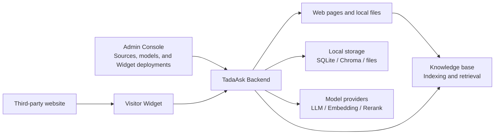
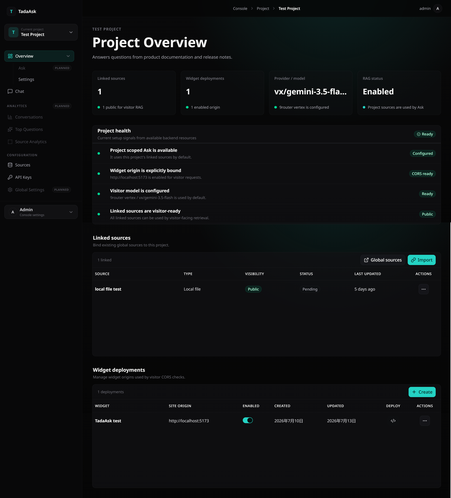
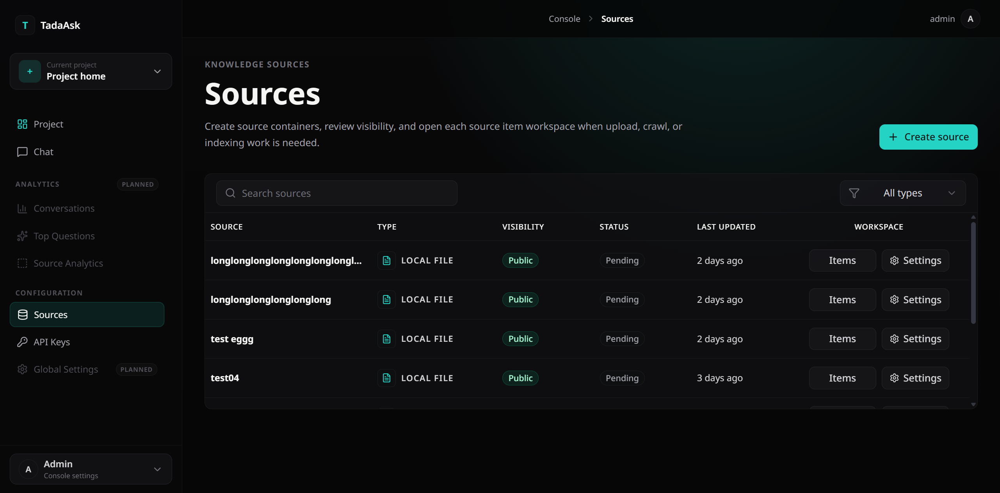
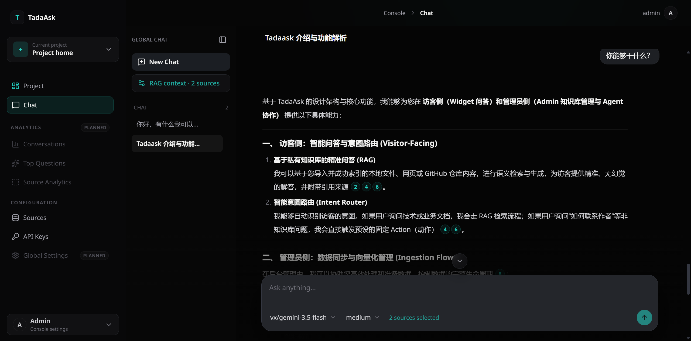
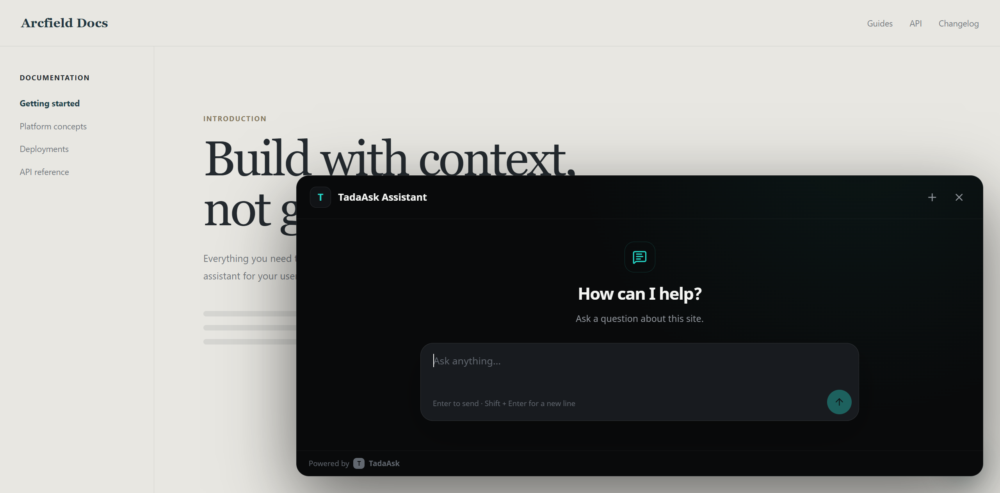
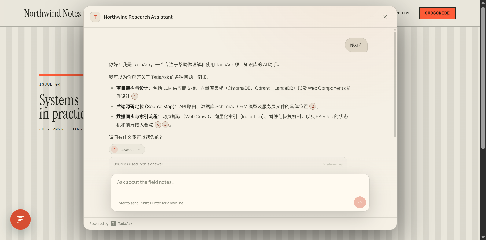

<div align="center">

```text
 ███████████               █████                █████████           █████     
▒█▒▒▒███▒▒▒█              ▒▒███                ███▒▒▒▒▒███         ▒▒███      
▒   ▒███  ▒   ██████    ███████   ██████      ▒███    ▒███   █████  ▒███ █████
    ▒███     ▒▒▒▒▒███  ███▒▒███  ▒▒▒▒▒███     ▒███████████  ███▒▒   ▒███▒▒███ 
    ▒███      ███████ ▒███ ▒███   ███████     ▒███▒▒▒▒▒███ ▒▒█████  ▒██████▒  
    ▒███     ███▒▒███ ▒███ ▒███  ███▒▒███     ▒███    ▒███  ▒▒▒▒███ ▒███▒▒███ 
    █████   ▒▒████████▒▒████████▒▒████████    █████   █████ ██████  ████ █████
   ▒▒▒▒▒     ▒▒▒▒▒▒▒▒  ▒▒▒▒▒▒▒▒  ▒▒▒▒▒▒▒▒    ▒▒▒▒▒   ▒▒▒▒▒ ▒▒▒▒▒▒  ▒▒▒▒ ▒▒▒▒▒ 
                                                                                                                                            
```

</div>

# TadaAsk

<p align="center">
  
  <a href="LICENSE"></a>
  <a href="https://github.com/tada-zako"></a>
  <a href="docs/README.zh.md"></a>
</p>

**TadaAsk is a self-hosted RAG knowledge-base service with an admin console and an embeddable visitor widget.** Build a unified knowledge base from web pages and local files, then provide answers with source citations.

> [!IMPORTANT]
> TadaAsk is currently intended for learning, demonstrations, and small self-hosted deployments. It has not been thoroughly validated for high-concurrency, multi-user, or mission-critical production workloads.
> Back up important data, secure the deployment, and evaluate it in a private environment before using it in production.

## Features

- **Embeddable on any website** — add a Visitor Widget to an existing site without building a separate app for visitors.
- **One place for different sources** — upload local files, crawl web pages, and manage their processing status in the admin console.
- **Traceable answers** — RAG answers include citations so visitors can check the original material.
- **Organized by project** — each project keeps its own sources, model settings, and widget deployment configuration; one instance can support several small sites.
- **Easy to get started** — Docker deployment, generated Widget embed code, and site-origin validation are available from the admin console.
- **Widget customization** — customize the Visitor Widget's title, appearance, and basic CSS variables.
- **Choose your own model provider** — configure providers, models, and API keys in the admin console.

## Architecture

TadaAsk consists of an admin interface, a visitor-facing widget, and a backend service. Administrators maintain sources and settings in the console; visitors ask questions through the widget embedded on a website; both use the same backend and knowledge base.



This setup is intended for small self-hosted deployments: data stays in your own runtime environment by default, while model providers are configured as needed.

## Quick Start

### Docker (recommended)

Prepare the environment files first:

```bash
cp backend/.env.example backend/.env
cp .env.docker.example .env
```

Set the administrator username and password, plus the required encryption settings (the API-key encryption key and JWT secret), then start the stack:

```bash
docker compose up -d --build
```

With the default configuration, the application is available at `http://localhost:8080` and only listens on the host's `127.0.0.1` interface.

For a public deployment, put HTTPS Nginx or Caddy in front of the application and set `TADAASK_PUBLIC_URL` correctly. See the [deployment configuration examples](deploy/).

Runtime data is stored in the `tadaask-data` Docker volume, including SQLite, Chroma, uploaded files, and model caches. Back up this volume before upgrades or migrations.

### Local development

#### Backend

The backend uses [uv](https://docs.astral.sh/uv/) for Python environment and package management:

```bash
cd backend
cp .env.example .env
uv sync
uv run uvicorn app.main:app --reload
```

At minimum, configure the following values in `backend/.env` before starting:

- `ADMIN_USERNAME` — admin console username
- `ADMIN_PASSWORD` — admin console password
- `JWT_SECRET_KEY` — JWT signing secret
- `PROVIDER_API_KEY_ENCRYPTION_KEY` — encryption key for stored provider API keys

Generate the two secrets with:

```bash
uv run python -c "import secrets; print(secrets.token_hex(32))"
uv run python -c "from cryptography.fernet import Fernet; print(Fernet.generate_key().decode())"
```

The backend runs at `http://localhost:8000` by default. The first start may download embedding or reranking models.

#### Frontend

The frontend uses [pnpm](https://pnpm.io/):

```bash
cd frontend
corepack enable  # optional: installs pnpm automatically
pnpm install
cp .env.example .env.development
pnpm dev
```

To preview the Widget locally:

```bash
pnpm dev:widget
```

### Widget deployment

The **Widget deployments** section on a project's page in the admin console generates the actual embed code. It looks like this:

```html
<script src="https://your-domain.example/widget/tada-ask-widget.js"></script>

<tada-ask-widget
  api-base-url="https://your-domain.example/api"
  project-uid="your-project-uid"
  widget-uid="your-widget-uid"
  assistant-title="TadaAsk Assistant"
></tada-ask-widget>
```

Set the host website's exact `site_origin` in the corresponding Widget configuration. The backend performs additional cross-origin validation for Widget requests.

> For customizable attributes and CSS variables, see [Visitor Widget customization](frontend/docs/tutorial/visitor-widget-customization.md).

## Screenshots

### Admin console

The project page brings sources, Widget deployment, and core settings into one workspace:



Manage uploaded files and crawled pages, along with their processing status:



Use global chat to test answers and citations directly from the admin console:



### Visitor Widget

Visitors can ask questions without entering the admin console:



The Widget supports basic appearance customization to suit the host website:



## Project scope

The current implementation is a **v0.1.0 MVP** with deliberate operational limits.

### Current limitations

- The FastAPI backend runs as a single worker; background jobs are held in process memory.
- Default storage is SQLite, embedded Chroma, and the local file system.
- Web crawling is still an MVP capability: it supports simple page crawling, not a full crawler feature set.
- A Visitor Widget session is not restored after a page refresh.
- Analytics, Project Ask, Global Settings, GitHub sources, Sitemap/Site Root sources, S3/MinIO, and multiple administrators are not implemented yet.

### Future plans

- [ ] Support more source types, including GitHub, sitemaps, and site-root crawling.
- [ ] Improve crawl scope control, update strategies, and error handling.
- [ ] Provide more complete usage analytics and visitor-session experiences.
- [ ] Evolve the backend architecture to support external services as needed.
- [ ] Support object storage and a more suitable way to run long-lived background work.
- [ ] Improve retrieval, citation rendering, and Widget interactions based on real-world feedback.

Future work will follow real needs, so this list is not a promise that every item will land on schedule. 🤯

## Contributing

TadaAsk is still evolving. Issues, documentation improvements, and pull requests are welcome.

If you run into a problem, an Issue with your deployment method, logs, and reproduction steps is much friendlier to debug than “it seems broken.” 😶‍🌫️

## License

TadaAsk is licensed under the [MIT License](LICENSE).

---

## About this project

<div align="center">

<p><i>这个项目是这条 <b>ただ_雑魚</b> 的一次尝试，还有很多不完美的地方，能多给点包容吗... (´･ω･`)</i></p>

**Made with 😶‍🌫️ by [tada-zako](https://github.com/tada-zako)**

</div>
