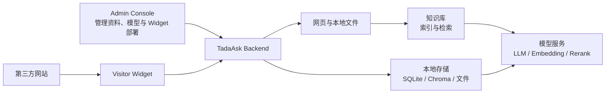

<div align="center">

```text
 ███████████               █████                █████████           █████     
▒█▒▒▒███▒▒▒█              ▒▒███                ███▒▒▒▒▒███         ▒▒███      
▒   ▒███  ▒   ██████    ███████   ██████      ▒███    ▒███   █████  ▒███ █████
    ▒███     ▒▒▒▒▒███  ███▒▒███  ▒▒▒▒▒███     ▒███████████  ███▒▒   ▒███▒▒███ 
    ▒███      ███████ ▒███ ▒███   ███████     ▒███▒▒▒▒▒███ ▒▒█████  ▒██████▒  
    ▒███     ███▒▒███ ▒███ ▒███  ███▒▒███     ▒███    ▒███  ▒▒▒▒███ ▒███▒▒███ 
    █████   ▒▒████████▒▒████████▒▒████████    █████   █████ ██████  ████ █████
   ▒▒▒▒▒     ▒▒▒▒▒▒▒▒  ▒▒▒▒▒▒▒▒  ▒▒▒▒▒▒▒▒    ▒▒▒▒▒   ▒▒▒▒▒ ▒▒▒▒▒▒  ▒▒▒▒ ▒▒▒▒▒ 

```

</div>

# TadaAsk

<p align="center">
  <a href="https://github.com/tada-zako/TadaAsk/releases/tag/v0.1.1"></a>
  <a href="../LICENSE"></a>
  <a href="https://github.com/tada-zako"></a>
  <a href="../README.md"></a>
</p>

**TadaAsk 是一个自托管的 RAG 知识库服务，包含管理控制台以及可嵌入网站的 Visitor Widget。** 它可以从网页和本地文件构建统一的知识库，并基于检索结果提供带引用的回答。

> [!IMPORTANT]
> TadaAsk 目前主要面向个人学习、演示和小规模自托管部署场景，尚未针对高并发、多用户或关键生产环境进行充分验证。
> 请务必在使用前备份关键数据、加固部署安全防范，并在私有环境进行充分评估后再用于生产环境使用。


## 功能特性

- **支持网站嵌入式部署**：通过 Visitor Widget 将问答入口嵌入现有网站，无需为访客单独准备一个应用。
- **统一管理不同资料**：支持上传本地文件和抓取网页内容，并在管理控制台中查看、更新和管理知识来源。
- **回答可溯源**：RAG 回答会附带对应的资料引用，方便访客回到原始内容核对。
- **按项目组织与部署**：不同项目可以维护各自的资料、模型设置和 Widget 部署配置，适合一个实例服务多个小型站点。
- **简单上手，开箱即用**：TadaAsk 支持 Docker 部署，Admin Console 提供 Widget 部署代码生成、站点来源校验。
- **Widget 样式可定制**：Visitor Widget 支持标题、外观和 CSS variables 等基础定制能力。
- **可自行选择模型服务**：Admin Console 中可配置不同 Provider、模型和 API Key。


## 项目架构

TadaAsk 由管理端、访客端和后端服务组成。管理员可以通过控制台维护 RAG 来源资料和配置；访客通过网站中部署的 Widget 进行提问；两者由同一套后端和知识库代码逻辑处理。



这是一个面向小规模自托管的组合：默认将数据保存在自己的运行环境中，并按需连接你配置的模型服务。


## 快速开始

### Docker（推荐）

首先请准备好环境配置：

```bash
cp backend/.env.example backend/.env
cp .env.docker.example .env
```

修改配置文件中的管理员账号、密码，并配置必要的加密配置（包括 API Key 加密密钥、JWT 安全配置）后启动：

```bash
docker compose up -d --build
```

默认配置下， docker 容器可以通过 `http://localhost:8080` 访问，并仅允许监听来自宿主机 `127.0.0.1` 的请求。

公网环境下的部署操作，应在外层配置 HTTPS Nginx 或 Caddy 转发请求，并正确设置 `TADAASK_PUBLIC_URL`，相关配置可以参考 [配置文件模板](../deploy/) 。

运行数据保存在 Docker volume `tadaask-data` 中，包括 SQLite、Chroma、上传文件和模型缓存。升级或迁移前请先备份该 volume。

### 本地开发

#### Backend 启动

后端开发推荐使用 [uv](https://docs.astral.sh/uv/) 作为 python 虚拟环境的包管理器，并运行如下命令：

```bash
cd backend
cp .env.example .env
uv sync
uv run uvicorn app.main:app --reload
```

启动前至少修改 `backend/.env` 中的以下配置：

- `ADMIN_USERNAME` —— admin console 登录用户名
- `ADMIN_PASSWORD` —— admin console 登录密码
- `JWT_SECRET_KEY` —— JWT 加密密钥
- `PROVIDER_API_KEY_ENCRYPTION_KEY` —— API Key 加密密钥

可以使用以下命令生成密钥：

```bash
uv run python -c "import secrets; print(secrets.token_hex(32))"
uv run python -c "from cryptography.fernet import Fernet; print(Fernet.generate_key().decode())"
```

后端默认运行于 `http://localhost:8000`。首次启动可能需要下载 embedding 或 rerank 模型，请耐心等待 desu~。

可以使用以下命令运行后端单元测试以及集成测试:

```bash
uv run pytest -m "not live"
```

请参阅 [backend testing notes](backend/README.md#tests)，了解后端测试覆盖率以及可选的 live-test（涉及到外部服务的真实测试） 指令。

#### Frontend

前端使用 [pnpm](https://pnpm.io/) 作为包管理器，首次运行请执行如下命令：

```bash
cd frontend
corepack enable  # 可选：自动安装 pnpm
pnpm install
cp .env.example .env.development
pnpm dev
```

本地 Widget 预览：

```bash
pnpm dev:widget
```

### Widget 部署

前端 Admin Console 在 **Project** 页面的 **Widget deployments** 部分可以生成用于嵌入到网站的实际部署代码，基本形式如下：

```html
<script src="https://your-domain.example/widget/tada-ask-widget.js"></script>

<tada-ask-widget
  api-base-url="https://your-domain.example/api"
  project-uid="your-project-uid"
  widget-uid="your-widget-uid"
  assistant-title="TadaAsk Assistant"
></tada-ask-widget>
```

部署前需要在对应 Widget 配置中填写宿主网站的准确 `site_origin`，后端会对 Widget 发起的请求进行额外的跨域验证。

> 可定制属性和 CSS variables 参见 [Visitor Widget 自定义](./visitor-widget-customization.zh.md)。


## 页面展示

### Admin 管理控制台展示

项目页将项目资料、Widget 部署和主要配置集中在一个工作区中：


知识来源可以查看已接入的文件或网页，以及它们的处理状态：


全局问答用于在管理端直接测试知识库的回答与引用：


### Visitor Widget 展示

访客无需进入管理端，只需在网站上打开 Widget 即可提问：


Widget 支持按站点风格进行基础外观定制：


## 项目边界

当前项目代码的实现仍处于 **v0.1.0 MVP** 阶段，具有较为严格的运行限制：

### 运行限制

- 目前后端 FastAPI 服务按单 worker 运行，后台任务保存在进程内
- 数据存储默认使用 SQLite、嵌入式 Chroma 和本地文件存储
- Web Crawl 仍属于 MVP 能力，只支持简单的网页爬取，未实现复杂的爬虫能力
- Visitor Widget 刷新页面后不会恢复此前的访客会话
- Analytics、Project Ask、Global Settings、GitHub Source、Sitemap/Site Root、S3/MinIO 和多管理员等功能尚未实现

### 未来计划

- [ ] 支持更多知识来源，例如 GitHub、网站地图和站点根目录。
- [ ] 完善网页抓取的范围控制、更新策略和异常处理。
- [ ] 提供更完整的使用统计与访客会话体验。
- [ ] 后端架构优化或重构，按需支持外部服务
- [ ] 支持对象存储，以及更适合长期运行的任务处理方式。
- [ ] 根据实际使用反馈改进检索效果、引用展示和 Widget 交互。

未来具体的开发方向会根据真实需求逐步推进，这里不保证所有计划都稳步推进实现🤯。


## 欢迎贡献

TadaAsk 仍处于迭代中，欢迎提交 Issue、修正文档，或发起 Pull Request。

如果你只是使用中遇到问题，也很欢迎附上部署方式、日志和可复现步骤来提 Issue；这对排查问题要友好得多😶‍🌫️。


## 许可证

TadaAsk 采用 **MIT** — 详见 [LICENSE](../LICENSE)。

---

## 关于项目


<div align="center">

<p><i>这个项目是这条 <b>ただ_雑魚</b> 的一次尝试，还有很多不完美的地方，能多给点包容吗... (´･ω･`)</i></p>

**Made with 😶‍🌫️ by [tada-zako](https://github.com/tada-zako)**

</div>
